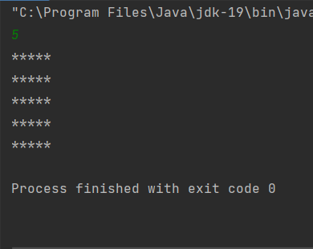
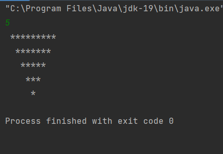
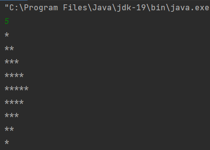

# Patterns-Assessment-13.03.2023
## 1.Print the following pattern as output.
```
****
****
****
****
```
PROGRAM:
```
import java.util.Scanner;
public class Q1 {
    public static void main(String[] args)
    {
        Scanner scan=new Scanner(System.in);
        int n=scan.nextInt();
        for(int i=0;i<n;i++)
        {
            for(int j=0;j<n;j++)
            {
                System.out.print("*");
            }
            System.out.println();
        }
    }
}
```

OUTPUT:


## 2.Print the follwing pattern as output.
```
*****
 ***
  *
```
PROGRAM:
```
import java.util.Scanner;
public class Q2 {
    public static void main(String[] args)
    {
        Scanner scan=new Scanner(System.in);
        int n=scan.nextInt();
        for(int i=n;i>=1;i--)
        {
            for(int j=n;j>=i;j--)
                System.out.print(" ");
            for(int k=1;k<=2*i-1;k++)
                System.out.print("*");

            System.out.println();
        }

    }
}

```
OUTPUT:



## 3.Print the following pattern as output:
```
*
**
***
****
***
**
*
```
PROGRAM:
```
import java.util.Scanner;
public class Q3 {
    public static void main(String[] args)
    {
        Scanner scan=new Scanner(System.in);
        int num=scan.nextInt();
        for(int i=1;i<=num;i++)
        {
            for(int j=1;j<=i;j++)
                System.out.print("*");
            System.out.println();
        }
        for(int i=num-1;i>=1;i--)
        {
            for(int j=1;j<=i;j++)
                System.out.print("*");
            System.out.println();
        }
    }
}

```
OUTPUT:


